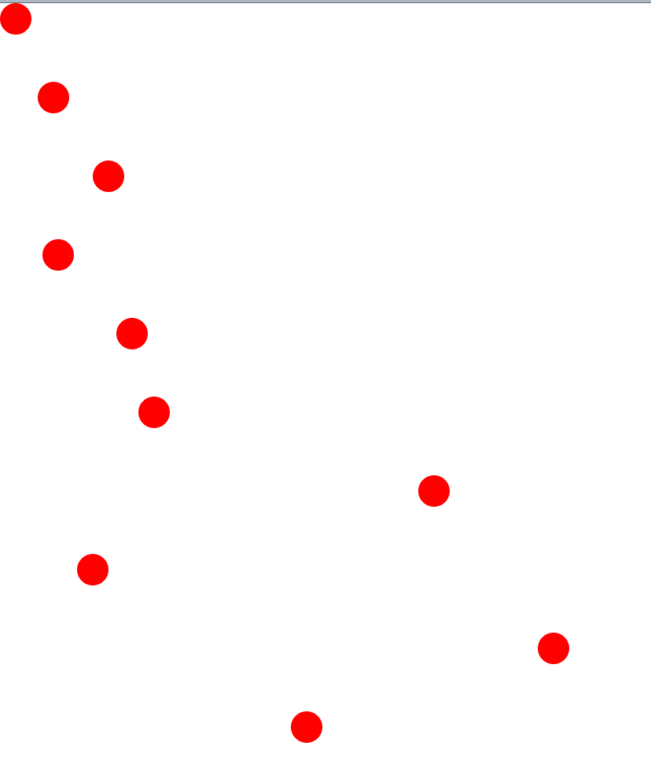
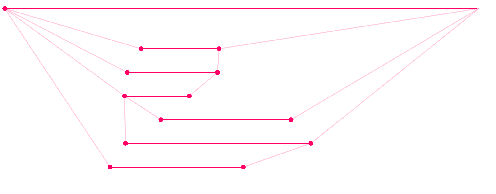
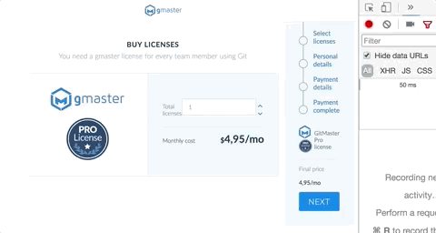

# Examples for the Javascript workshop in Codice Software (27/07/2017)

## Basic Javascript

### Basic.JS

* Example of function scope (*var* values are available after a block: *if*, *while*, *for*...). Javascript does not have block scoping (as Java or C#) when we use *var*.
* Example of mutating the counter variable in a loop

### Closures

* Example of closure where we can store *state* of a function that does not exist anymore.

### IIFE

* Example of the module revealed pattern, we can define private "methods" by creating a function and auto executing it. We can call *manual_drive* (our renamed *drive* method) but not the *crash* method.

### this

* Several examples in *this.js* and *this-more-examples.js* about 3 ways of getting the *this* value: by default, implicit with an object, explicit with bind (or call and apply) and storing *this* value in a variable.

### new

* Example defining and overriding a method by creating an object linked through the [[Prototype]] (with Object.create) and adding a new method to all the instances.

## DOM example

* Example rendering cute red balls dynamically

## SVG example

* Example using svg to simulate several branches

## Babel example

* An example of transpiling that uses a stage 3 feature to remove a comma :)

## Node examples

* One example of a basic node server
* An example with an express server that does a network request and returns a list of images

## Views examples

### Angular example

* A sample application with routing and a form, can be launched with *ng serve -o*

### Vue example

* The sample application, can be launched with *npm run dev*

### React example

* A react sample application passing props to a children component. Can be launched with *npm run start*

## ES6 examples

### Arrow functions

* A small example about how arrow functions capture the parent *this*

### Classes

* A sample of the class syntax in ES6

### Generators

* A fibonacci calculator with generators that is executed partially

### Modules

* Values and functions exported as modules and used in *using-modules.js*

### Promises

* A promise example using setTimeout to create and promises and *Promise.all*
* An example using fetch to do a network call

### String templates

* A basic example using string templates to simulate a layout

## Tests examples

* Several tests (failing) testing es2015 features (*es2015.spec*). Can be launched with karma or *npm test*.
